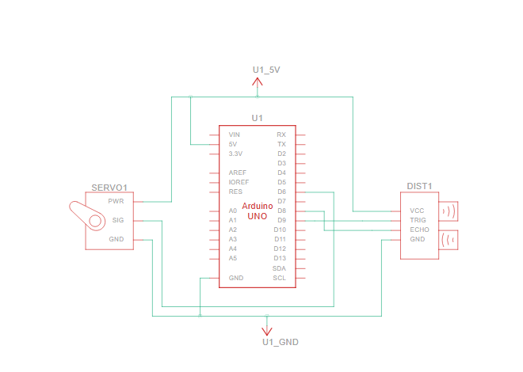

# Light Automation Using Ultrasonic Sensor and Servo Motor

This Arduino project uses an ultrasonic sensor to detect when a door is opened or closed, and moves a servo motor to turn a light switch on or off. 

## Components Required
- Arduino Uno R3
- Ultrasonic sensor (HC-SR04)
- Servo motor
- Jumper wires
- Breadboard

## Schematics Diagram

## Connections
- **Ultrasonic Sensor:**
  - VCC to Arduino 5V
  - GND to Arduino GND
  - Trig to Arduino pin 9
  - Echo to Arduino pin 8
- **Servo Motor:**
  - VCC to Arduino 5V
  - GND to Arduino GND
  - Signal to Arduino pin 6

## Usage
1. Connect the components as per the circuit diagram.
2. Upload the code to your Arduino board.
3. Mount the wall with ultrasonic sensor facing door.
4. Observe the servo motor movement as the door opens and closes.
